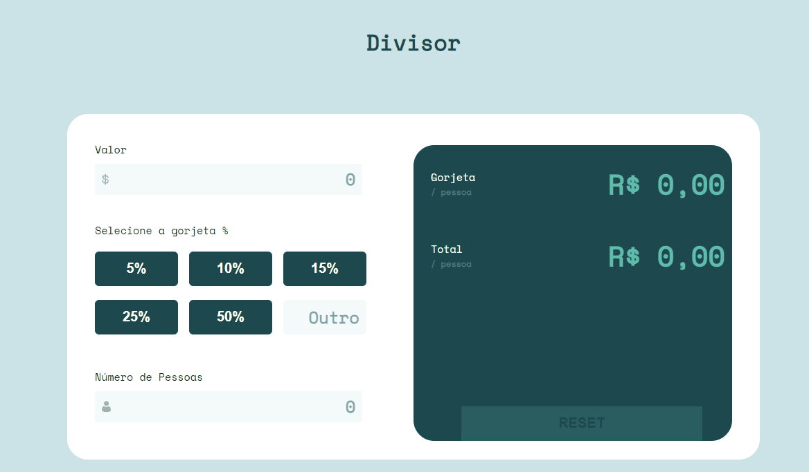

<h1> Solução do desafio 'calculadora de gorjeta' do site Frontend Mentor</h1>
<h2><a href="https://www.frontendmentor.io/challenges/tip-calculator-app-ugJNGbJUX"  target="_ blank">desafio proprosto</a></h2>

<h2>
    
</h2>

  
<h2>Sobre o desafio</h2>

Os usuários devem ser capazes de:

- Visualizar o tamanho ideal de layout de acordo com a tela
- Ver os status de hover entre todos os elementos interativos do aplicativo
- Calcular a gorjeta correta e o custo total da conta por pessoa

<h2>Link para utilização</h2>
<a href="https://calculadordegorjeta.netlify.app/" target="_blank" >Clique aqui</a>
  
<h2>Construído com</h2>

- HTML5 semântico
- CSS3
- Flexbox
- CSS Grid
- JavaScript

 
<h3>O que aprendi</h3>

Com esse projeto fui capaz de treinar manipulação através do DOM (Document Object Model), HTML5 semântico e CSS3.

<h3>Made with :heart: by Elivelton</h3>
